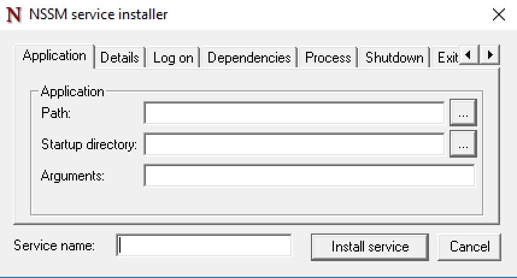
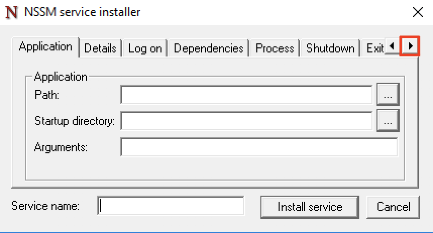

# Busloc

**TODO: Add description**

## Installation

Busloc is managed as a service using NSSM, which can be downloaded [here](http://nssm.cc/download). After ensuring that the
appropriate `nssm` file is on the `%PATH%`, services can be configured in the command line using the `nssm` command.

On initial setup, run `nssm install`, enter a name for the service in the box,
and set up the parameters of the service using the GUI that appears.  


* **Path**: the full path to the executable it will be running - in this case, the `mix` file in your Elixir install (or `mix.bat` for Windows systems)
* **Startup directory**: the Busloc application directory - the directory containing Busloc's `mix.exs`
* **Arguments**: the arguments provided to the `mix` command - for Busloc, `do local.hex --force, deps.get, run --no-halt`

* The rest of the defaults should be fine, except for Environment variables, which are configured in the "Environment" tab.
You can navigate to it with the right arrow in the upper right corner of the GUI.  
  
* By default, log output will go to `stdout`, so if you want to view logs locally, you can tell it to direct the logs to a file using the "I/O" tab. (Logs will still be sent to Splunk regardless.)

---

Once the service is configured, click "Install service" and then the service can be started with
the command line prompt `nssm start <service-name>`.

The configuration can be changed later with the command `nssm edit <service-name>`.
After changing configurations, make sure to run `nssm restart <service-name>` so the new configuration takes effect.


## Waivers

In order to access waiver data, we make a direct connection to the
TransitMaster DB. We use a CLI tool called `sqlcmd` for this.

### OS X

```bash
brew tap microsoft/mssql-release https://github.com/Microsoft/homebrew-mssql-release
brew update
brew install --no-sandbox msodbcsql mssql-tools
```

### Windows

ODBC: https://www.microsoft.com/en-us/download/details.aspx?id=36434
CLI Tools: https://www.microsoft.com/en-us/download/details.aspx?id=36433
